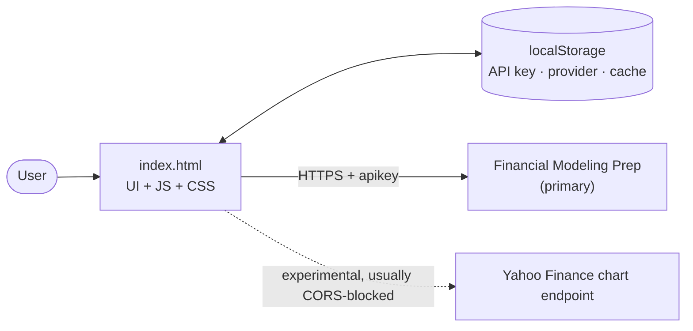

# 📈 Value Stock Finder

**A personal, browser-only stock screener built around classic value-investing checklists.**

Value Stock Finder scans a list of ticker symbols, pulls market and financial-statement data from [Financial Modeling Prep (FMP)](https://site.financialmodelingprep.com/), and scores each company against practical checks inspired by Graham, Fisher, Dreman, John Neff, Piotroski and Buffett. It also shows an educational DCF fair-value estimate and a margin-of-safety check.

The whole app is a single `index.html` file. It has no backend, no build step and no dependencies.

> ⚠️ **Educational tool, not financial advice.** Value Stock Finder does not recommend, endorse or guarantee any security. Scores are mechanical checklists run over third-party data that may be incomplete, delayed or wrong. Always do your own research and consult a licensed professional before investing.

<p align="center">
  <a href="docs/USER_GUIDE.md"><b>📖 User Guide</b></a> ·
  <a href="SPEC.md"><b>📋 Specification</b></a> ·
  <a href="docs/architecture.md"><b>🏗 Architecture</b></a> ·
  <a href="docs/investment-methodology.md"><b>📐 Methodology</b></a> ·
  <a href="docs/roadmap.md"><b>🗺 Roadmap</b></a>
</p>

---

## Table of Contents

- [Screenshots](#-screenshots)
- [Why This Project Exists](#-why-this-project-exists)
- [Core Features](#-core-features)
- [Current Architecture](#-current-architecture)
- [Data Providers](#-data-providers)
- [FMP Setup](#-fmp-setup)
- [Yahoo Finance Warning](#-yahoo-finance-warning)
- [Running Locally](#-running-locally)
- [How to Use](#-how-to-use)
- [Scan Modes](#-scan-modes)
- [Value Strategies Included](#-value-strategies-included)
- [DCF / Fair Value](#-dcf--fair-value)
- [Data Confidence](#-data-confidence)
- [Limitations](#-limitations)
- [Security & Privacy](#-security--privacy)
- [Roadmap](#-roadmap)
- [Documentation](#-documentation)
- [License](#-license)
- [Disclaimer](#-disclaimer)

---

## 🖼 Screenshots

> _Screenshots have not been added yet._ Planned additions: the scan settings panel, the results table, and an expanded row with strategy and DCF details.

## 💡 Why This Project Exists

Value-investing courses teach clear, mechanical first-pass filters: revenue size, P/E ranges, the Graham ratio, debt levels, cash-flow quality and so on. Applying them by hand across dozens of companies is slow and error-prone.

Value Stock Finder automates that **first pass**. It does not decide what to buy. It narrows a list down to companies worth a closer manual look and shows exactly which checks passed, failed, or could not be evaluated because data was missing.

## ✨ Core Features

| Feature | Status | Description |
| --- | --- | --- |
| Preset & manual symbol lists | ✅ Current | Four preset US lists (large caps, value, tech, dividend, 30 each), three curated expanded US lists (90 / 95 / 60 symbols), plus free-form symbol entry |
| Momentum / Market scan | ✅ Current | Quote-only quick scan, 1 request per symbol |
| Deep Scan | ✅ Current | Quote plus 9 fundamental FMP endpoints per symbol |
| Two-stage scan | ✅ Current | Quote-only Stage 1 over a larger list (up to 200), then Deep Scan only on the top N candidates (up to 30) |
| Strategy scoring | ✅ Current | Graham, Fisher, Cash Flow, Buffett-inspired, Piotroski approx., Dreman/Neff relative |
| Estimated Fair Value / DCF | ✅ Current | Configurable educational DCF with margin of safety and DCF confidence |
| Data Confidence | ✅ Current | Share of key metrics actually available for each stock |
| Local cache | ✅ Current | localStorage cache (quotes 10 minutes, fundamentals 7 days) to save API calls |
| Request preview | ✅ Current | Estimates API and cache usage before you scan |
| Stop scan & rate-limit safety | ✅ Current | Stop button; the scan halts cleanly when the provider rate-limits |
| Endpoint test | ✅ Current | Checks which FMP endpoints your plan allows, using AAPL |
| CSV export | ✅ Current | Exports the displayed top-N results with scores and DCF fields |
| Yahoo Finance provider | 🧪 Experimental | Browser connectivity test only; likely blocked by CORS |
| Automatic universe discovery, TASE, global markets | 🗓 Planned / Future | See [roadmap](docs/roadmap.md) |

## 🏗 Current Architecture



- **One file:** HTML, CSS and JavaScript all live in `index.html`.
- **Browser-only runtime:** every API call goes directly from your browser to the data provider.
- **State:** in memory during a scan, plus `localStorage` for the API key, the selected provider and the response cache.

Details: [docs/architecture.md](docs/architecture.md) · Decision: [ADR-0001](docs/decisions/ADR-0001-single-file-static-app.md)

## 🔌 Data Providers

| Provider | Role | Supports | Notes |
| --- | --- | --- | --- |
| **Financial Modeling Prep** | Primary, default | Quote + Deep Scan + DCF | Requires an FMP API key. Some endpoints may be restricted by plan. Restricted endpoints are marked as missing data and the scan continues. |
| **Yahoo Finance Experimental / Browser test only** | Experimental | Quote-level only | No key. Not an official API. Browser/CORS will likely block requests. Deep Scan is blocked. |

See [docs/api-integrations.md](docs/api-integrations.md) and [ADR-0002](docs/decisions/ADR-0002-fmp-primary-provider.md).

## 🔑 FMP Setup

1. Create an account at Financial Modeling Prep and copy your API key.
2. Open the app and paste the key into **API Key (FMP)**.
3. Click **בדוק endpoints על AAPL** ("test endpoints on AAPL") to see which endpoints your plan allows.
4. The key is saved to your browser's `localStorage` the first time you run a scan or a test. Use **נקה API Key שמור** ("clear saved API key") to remove it.

> The key is sent as a URL query parameter on every FMP request, and it is visible in browser dev tools. Read [Security & Privacy](#-security--privacy) before using a key you care about.

## 🧪 Yahoo Finance Warning

The **Yahoo Finance Experimental / Browser test only** provider exists only as a connectivity experiment:

- Yahoo Finance is **not an official or unlimited public API**.
- The endpoint it calls does not send CORS headers, so **browsers are likely to block the request** in this static app.
- Even when it works, it returns **quote-level data only**: no market cap, no financial statements and no DCF.
- **Deep Scan is blocked** when Yahoo is selected.
- It is **not a reliable replacement for FMP**.

## ▶️ Running Locally

There is nothing to install.

**Option A: open the file directly**

Open `index.html` in a modern browser (Chrome, Edge, Firefox or Safari).

**Option B: serve it with a simple static server (recommended)**

```bash
python3 -m http.server 8000
```

Then open <http://localhost:8000/>. A real `http://` origin behaves more predictably than `file://` for `localStorage` and network requests.

## 🧭 How to Use

1. Keep **Data Provider** on **Financial Modeling Prep**.
2. Enter your FMP API key.
3. Choose a preset list, or pick **ידני** (manual) and type symbols such as `AAPL, MSFT, KO`.
4. Choose a scan mode (see below) and review the **request preview** under the buttons. For larger lists, choose **Two-stage scan** and set *Stage 1 max symbols* and *Deep Scan Top N*.
5. Optionally adjust the filters (minimum market cap, volume, price) and the DCF assumptions.
6. Click **סרוק מניות** (scan stocks). Use **עצור סריקה** (stop scan) to stop before the next symbol.
7. Read the summary, filter the table tabs (All / Strong / Watchlist / Rejected) and open **פתח פירוט** (open details) on any row.
8. Click **ייצא CSV** (export CSV) to export.

The full walkthrough is in the [User Guide](docs/USER_GUIDE.md).

## 🔍 Scan Modes

| Mode (UI label) | Requests per symbol | What it fills |
| --- | --- | --- |
| **Value Scan מלא ככל האפשר** (Deep Scan, default) | 10 (quote + 9 fundamentals) | Everything: strategies, Piotroski, relative checks, DCF |
| **Momentum / Market בלבד** | 1 (quote) | Momentum / Market score. Fundamental strategies and DCF show as missing. |
| **Two-stage scan** | Stage 1: 1 per symbol (up to *Stage 1 max symbols*, default 50). Stage 2: 9 per candidate (up to *Deep Scan Top N*, default 10), reusing the Stage 1 quote from cache. | Final table shows only the deep-scanned candidates, fully scored |

A Deep Scan of more than 10 symbols asks for confirmation first, as does a Two-stage scan estimated at more than 100 calls. Cached responses don't consume API calls.

**Two-stage scan** is the cost-saving way to screen the expanded lists:

1. Stage 1 checks quote-level data only.
2. Candidates are ordered by the existing basic filter, total score and Momentum / Market score. This is a practical ordering, **not a value signal**, and it favors large, liquid, trending stocks.
3. Only the top N candidates that passed the basic filter get the full Deep Scan.

Scoring rules are unchanged. Two-stage scan is FMP-only; it is blocked with Yahoo.

## 📐 Value Strategies Included

All strategies are **inspired by** published approaches and course notes. They are **approximations**, not exact reproductions.

| Column | Idea in one line |
| --- | --- |
| Momentum / Market | Size, liquidity, trend versus the 50/200-day averages, and position in the 52-week range |
| Graham | Revenue size, current ratio, working capital vs long-term debt, P/E range, Graham ratio (P/E × P/B < 22), multi-year EPS growth |
| Fisher | Cheap on 2 of 3 multiples, profit margin, EPS CAGR, low debt, positive FCF per share |
| Cash | Cash-flow structure, earnings quality (OCF ≥ NI), FCF, Sloan ratio |
| Buffett Inspired | EPS growth, high ROE/ROA, FCF, 5-year earnings versus long-term debt |
| Piotroski Approx. | 9-point year-over-year F-score approximation |
| Dreman Inspired / Relative | Cheap relative to peers **within the scanned list**, plus quality filters |
| Neff Inspired / Relative | Low P/E relative to peers in the scanned list, moderate growth, total-return/P/E |

Exact thresholds are in [docs/investment-methodology.md](docs/investment-methodology.md).

## 💰 DCF / Fair Value

The app estimates fair value per share with a simple free-cash-flow DCF:

- **Base FCF:** the average of up to 5 annual FCF values (or the latest, if only one exists).
- **Growth:** historical FCF CAGR, then FMP FCF growth, then revenue growth, **clamped to 0%–8%**.
- **Assumptions** you can edit: discount rate (10%), terminal growth (2.5%), projection years (5) and required margin of safety (25%).
- **Outputs:** Fair Value, Upside, Discount from Fair Value, Margin of Safety pass/fail, and DCF Confidence.

If FCF is missing or not positive, shares outstanding are missing, or the discount rate is not above terminal growth, the DCF shows **"Not enough data" / "חסר נתון"**. The DCF is **informational only**: it does not change the total score. It is a rough educational estimate, not a valuation.

## 📊 Data Confidence

Data Confidence is the percentage of 19 key metrics (price, market cap, volume, multiples, returns, statements, shares and so on) that were actually available. A stock can be labeled **Strong Candidate** only when confidence is at least **70%** and none of the core fields (price, market cap, volume) is missing. This keeps a high score built on sparse data from being labeled strong.

## ⚠️ Limitations

- Results are only as good as the provider's data. Fields can be missing, stale, or defined differently than in a course.
- Relative (Dreman / Neff) comparisons use **only the symbols in the current scan**, not a full industry or market universe.
- The DCF ignores net debt and cash, uses a capped growth rate and is highly sensitive to its assumptions.
- Preset lists are US-only and hand-curated. There is no automatic market-wide discovery. Israel/TASE and global coverage are **planned**, not implemented.
- Scans run one symbol at a time in the browser, so large universes are slow and limited by your FMP plan. Two-stage scan reduces deep calls, but Stage 1 ordering uses quote-level data only and can miss value candidates that are trading weakly.
- The Yahoo provider is experimental and usually blocked by browser CORS.
- The UI is primarily Hebrew (RTL). Metric names are in English.

## 🔒 Security & Privacy

- **A static HTML app cannot truly hide an API key.** The key lives in the page, in `localStorage`, and in every request URL. Anyone with access to your browser profile or dev tools can read it.
- `localStorage` is a **convenience, not secure storage**.
- Do **not** host this page publicly with a real key embedded, and do not commit keys to Git.
- Hiding the key would require a backend or proxy. That does not exist today; see [ADR-0003](docs/decisions/ADR-0003-no-backend-yet.md).

Full details: [docs/security.md](docs/security.md)

## 🗺 Roadmap

| Milestone | Status |
| --- | --- |
| M0 Initial static app | ✅ Done |
| M1 Cache, confidence and rate-limit safety | ✅ Done |
| M2 DCF / fair value | ✅ Done |
| M3 Provider abstraction + Yahoo experimental | ✅ Done (Yahoo 🧪 Experimental) |
| M4 Documentation foundation | ✅ Done |
| M5 Two-stage scan + expanded preset lists | ✅ Done |
| Automatic universe discovery, TASE, global, tests/CI, optional backend | 🗓 Planned / Future |

Full roadmap: [docs/roadmap.md](docs/roadmap.md)

## 📚 Documentation

| Document | Purpose |
| --- | --- |
| [SPEC.md](SPEC.md) | Product and technical specification |
| [AGENTS.md](AGENTS.md) | Rules for AI coding agents |
| [CLAUDE.md](CLAUDE.md) | Claude Code–specific instructions |
| [docs/USER_GUIDE.md](docs/USER_GUIDE.md) | End-user guide |
| [docs/architecture.md](docs/architecture.md) | Architecture and data flow |
| [docs/product-requirements.md](docs/product-requirements.md) | Product requirements, personas, future scope |
| [docs/investment-methodology.md](docs/investment-methodology.md) | Strategy rules and thresholds |
| [docs/api-integrations.md](docs/api-integrations.md) | FMP and Yahoo integration details |
| [docs/security.md](docs/security.md) | Security model and API key risks |
| [docs/verification.md](docs/verification.md) | Checks to run before every PR |
| [docs/roadmap.md](docs/roadmap.md) | Milestones and planned work |
| [docs/HISTORY.md](docs/HISTORY.md) | Project history and lessons learned |
| [docs/decisions/](docs/decisions/) | Architecture decision records |

## 📄 License

This project is licensed under the MIT License. See [LICENSE](LICENSE) for details.

## ⚖️ Disclaimer

Value Stock Finder is an **educational and personal research tool**. It is **not investment advice**, does not identify "good" or "bad" stocks, and does not imply any expected return. Scores, fair-value estimates and margins of safety are mechanical outputs of simplified rules applied to third-party data. They do not replace professional financial analysis or advice from a licensed advisor.
