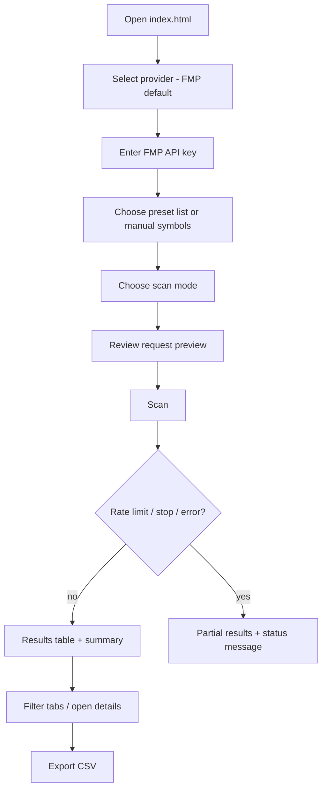

# Value Stock Finder — Specification

Status: **current as of 2026-10-08** (after PR #6: Two-stage scan and expanded presets)

This specification describes what the app does **today** and what is **planned**. Sections are marked **Current**, **Experimental**, **Planned** or **Non-goal**. Thresholds are summarized here. The authoritative list is in [docs/investment-methodology.md](docs/investment-methodology.md).

---

## 1. Product overview

Value Stock Finder is a single-file, browser-only stock screener. It fetches market and fundamental data for a user-supplied list of symbols, applies value-investing checklists inspired by Graham, Fisher, Dreman, John Neff, Piotroski and Buffett, estimates an educational DCF fair value, and ranks the results in a table that can be exported to CSV.

It is an **educational, personal research tool**. It is **not investment advice**.

## 2. Target user

- A self-directed individual investor or student who is learning value investing (originally from a Hebrew-language course summary).
- Comfortable obtaining an API key and opening a local HTML file.
- Wants transparent, explainable checks rather than a black-box rating.

## 3. Problem statement

Course checklists (P/E ranges, Graham ratio, cash-flow quality, debt limits and so on) are simple to state but tedious to apply by hand across many companies. The data also lives in several financial statements. The user needs a fast **first-pass filter** that shows which checks passed, failed, or could not be evaluated, so that manual research can focus on a short list.

## 4. Goals

1. Apply well-defined, documented checklists consistently across a list of symbols.
2. Make missing or restricted data visible, never silent.
3. Minimize API usage (cache, request preview, stop, rate-limit halt).
4. Stay trivially runnable: one HTML file, no install, no build.
5. Stay honest: educational labels, confidence indicators, no recommendations.

## 5. Non-goals

| Non-goal | Reason |
| --- | --- |
| Giving buy/sell recommendations | Educational tool. Outputs are checklists, not advice. |
| Guaranteeing data accuracy | Data comes from third parties. |
| Hiding API keys | Impossible without a backend (see [ADR-0003](docs/decisions/ADR-0003-no-backend-yet.md)). |
| Real-time trading, portfolios, alerts | Out of scope. |
| Exactly reproducing any investor's or course's proprietary method | The rules are approximations. |
| Framework migration (React, Vite, Next.js…) | See [ADR-0001](docs/decisions/ADR-0001-single-file-static-app.md). |

## 6. Core user flows



Secondary flows: **Test endpoints on AAPL** (FMP), **Test selected provider** (one AAPL quote), **Clear cache**, **Clear saved API key**.

## 7. Functional requirements (Current)

| ID | Requirement |
| --- | --- |
| FR-1 | The user can choose a data provider: Financial Modeling Prep (default) or Yahoo Finance Experimental / Browser test only. The choice persists in `localStorage`. |
| FR-2 | The user can enter an FMP API key. It is saved to `localStorage` when a scan or test runs, and can be cleared. |
| FR-3 | The user can load one of 4 preset US lists (30 symbols each), one of 3 curated expanded US lists (Large Cap 90, Value 95, Dividend 60), or keep a manual list. Symbols are split on whitespace, commas and semicolons, upper-cased and de-duplicated. |
| FR-4 | The user can choose Deep Scan (default), Momentum / Market, or Two-stage scan. |
| FR-5 | The user can set top-N (default 15), minimum market cap for US (default 2B) and non-US (default 1B), minimum volume (100,000) and minimum price (5). |
| FR-6 | The user can set DCF assumptions: discount rate 10%, terminal growth 2.5%, projection years 5 (1–10), margin of safety 25%. |
| FR-7 | A request preview shows the provider, the number of requests and the expected cache hits, and updates as inputs change. |
| FR-8 | A Deep Scan with FMP over more than 10 symbols requires confirmation. |
| FR-9 | Symbols are scanned sequentially. A stop button halts the scan before the next symbol. |
| FR-10 | Each stock gets the Momentum score, the strategy categories, Piotroski, Dreman/Neff relative scores, DCF, Data Confidence, total score and a decision. |
| FR-11 | Results are sorted by total score. The table shows the top N; the summary covers all evaluated stocks. |
| FR-12 | Table tabs filter All / Strong / Watchlist / Rejected. |
| FR-13 | Each row has expandable details: per-test results, relative basis, DCF inputs and reasons, data confidence, missing fields, data source and endpoint errors. |
| FR-14 | CSV export of the displayed top-N results (44 columns, including `dataProvider`, `scanMode`, `scanStage`, `stage1Rank`). |
| FR-15 | The FMP endpoint test checks the quote plus the 9 deep endpoints on AAPL. |
| FR-16 | The selected-provider test makes a single AAPL quote request on demand. |
| FR-17 | Clear Cache removes all FMP and Yahoo cache entries. |
| FR-18 | Two-stage scan settings: *Stage 1 max symbols* (default 50, clamped 1–200) and *Deep Scan Top N* (default 10, clamped 1–30). Invalid values are clamped when a scan starts. |
| FR-19 | Two-stage Stage 1 fetches the quote only, the same path as Momentum / Market, for the first *max* symbols. It never calls deep endpoints. |
| FR-20 | Two-stage Stage 2 runs the full FMP Deep Scan only for the top N Stage 1 candidates that pass the basic filter. The final table shows only Stage 2 rows. |
| FR-21 | The Two-stage preview shows Stage 1 quote calls (with cache), Stage 2 max (candidates × 9), the estimated max before cache, and how many symbols are beyond the Stage 1 max. A scan estimated at more than 100 calls requires confirmation. |
| FR-22 | Two-stage status shows `Stage 1 … X/Y` and `Stage 2 … X/Y`. A summary line shows Stage 1 checked, candidates selected, Stage 2 deep-scanned, API calls and cache hits. |
| FR-23 | Two-stage scan is blocked with Yahoo: "Yahoo Experimental / Browser test only does not support Two-stage scan because Stage 2 requires FMP Deep Scan." |

## 8. Non-functional requirements

| ID | Requirement |
| --- | --- |
| NFR-1 | Single static file: `index.html`. No dependencies, no build, no backend. |
| NFR-2 | Runs in a modern browser, opened directly or from a simple static server. |
| NFR-3 | The UI is RTL Hebrew-first. Metric and strategy names stay in English. |
| NFR-4 | The page must not crash when storage is restricted. `localStorage` reads are wrapped in `try/catch`. |
| NFR-5 | Provider failures must never crash the scan. They are recorded per symbol or stop the scan with a clear message. |
| NFR-6 | API usage is conservative: caching, small delays between calls (70 ms between deep endpoints, 120 ms / 60 ms between symbols) and a confirmation for large deep scans. |
| NFR-7 | No secrets in the repository. |
| NFR-8 | All dynamic text in table HTML is escaped (`escapeHtml`). |

## 9. Scan modes

| Mode | Value | Requests / symbol | Notes |
| --- | --- | --- | --- |
| Value Scan מלא ככל האפשר (Deep Scan) | `deep` | 10 | Quote + profile, ratios TTM, key metrics TTM, ratios annual, key metrics annual, income, cash flow, balance sheet, financial growth. FMP only. |
| Momentum / Market בלבד | `quick` | 1 | Quote only. Fundamentals and DCF show as missing. |
| Two-stage — Quick then Deep ("Two-stage scan — Quick filter first, then Deep Scan top candidates") | `twoStage` | Stage 1: 1 per symbol (≤ max). Stage 2: 9 per candidate (≤ Top N); the quote comes from the Stage 1 cache. | FMP only. See §9a. |

### 9a. Two-stage scan behavior

1. **Stage 1:**
   - Takes `symbols.slice(0, maxSymbols)` and fetches each one in `quick` mode.
   - Runs `evaluateStock` on each, without relative strategies.
   - Orders the rows with `rankStageOneCandidates`. This is candidate ordering, not scoring (see [methodology §13](docs/investment-methodology.md#13-two-stage-scan-candidate-ordering)).
2. **Selection:** only rows with `passBasic`, then the first `topN`. If none pass, Stage 2 is skipped and the preliminary Stage 1 rows are shown, labeled as such.
3. **Stage 2:** `deep` fetch per candidate, then `evaluateStock` and `applyRelativeStrategies` over the Stage 2 rows only. The usual total-score sort and top-N display limit (`topLimit`) apply.
4. **Stop:**
   - During Stage 1, Stage 2 is not run, and the preliminary Stage 1 rows are shown, labeled "Stage 1 בלבד (quote)".
   - During Stage 2, the partial deep rows are shown.
5. **Rate limit:** the scan halts immediately. Stage 2 deep rows are shown if any exist; otherwise the preliminary Stage 1 rows.
6. Rows carry `scanMeta = { mode, stage, stage1Rank, stage1Total }`, which is shown in the source column and the details, and exported to CSV.

## 10. Scoring strategy (summary)

- Categories: Graham, Fisher, Cash, Buffett (percent), Piotroski (x/9), Dreman and Neff (percent, relative).
- Missing-data tests are excluded from a category's denominator. A category with no evaluable tests is "missing".
- `Total = round(0.15 × Momentum + 0.85 × mean(available category %))`.
  - This formula applies to **final rows**, after `applyRelativeStrategies()` / `recomputeTotalAndDecision()`. All Deep Scan, Momentum / Market and Two-stage Stage 2 rows go through this step.
  - `evaluateStock()` first computes a preliminary total (`0.20 × Momentum + 0.80 × value average`), which the final recompute replaces.
  - Two-stage **Stage 1-only fallback rows** skip the final recompute and may display this preliminary score. These are preliminary quote-level rows, shown when Stage 2 did not run or did not complete. They must **not** be interpreted as final value scores.
- Decision:
  - **Strong:** passBasic, data confidence strong, total ≥ 75, and Cash ≥ 60 or Cash missing.
  - **Watchlist:** passBasic and total ≥ 55.
  - **Manual review:** passBasic and total < 55.
  - **Rejected:** otherwise.
- The DCF is **not** part of the total or the decision.

Changing any threshold or weight is a **behavior change**. It must be called out explicitly in the PR (see [AGENTS.md](AGENTS.md)).

## 11. Provider behavior

| Provider | Status | Quote | Deep | Key | Cache TTL |
| --- | --- | --- | --- | --- | --- |
| FMP | **Current**, default | ✅ `/stable/quote` | ✅ 9 endpoints | Required | Quote 10 min, others 7 days |
| Yahoo | **Experimental** / Browser test only | ⚠️ `v8/finance/chart` (1y daily), usually CORS-blocked | ❌ Blocked | None | 10 min |

Provider functions: `getSelectedProvider()`, `providerLabel()`, `fetchQuoteData()`, `fetchStockDataByProvider()`. The FMP scan path calls the original `fetchStockData()`.

Yahoo mapping provides price, change %, volume, 52-week high/low, 50/200-day averages (computed from closes), name, exchange and currency. **No market cap**, so Yahoo rows fail the basic filter.

## 12. Data model / internal metrics

Each scanned symbol produces a **raw record**:

```text
{ symbol, provider, quote, profile, ratiosTtm, keyMetricsTtm,
  ratiosAnnual[], keyMetricsAnnual[], income[], cash[], balance[], growth[],
  endpointErrors[], endpointSources[], apiCalls, cacheHits }
```

`buildMetrics(raw)` normalizes it into a **metrics object** `m`. It tries several field aliases per metric:

| Group | Fields |
| --- | --- |
| Identity | symbol, name, sector, industry, exchange, isUsListed, isTechPharma |
| Market | price, changePercentage, volume, marketCap, priceAvg50, priceAvg200, yearHigh, yearLow |
| Ratios | pe, ps, pb, roe, roa, debtEquity, currentRatio, profitMargin, grossMargin |
| Dividend | dividendAmount, dividendYield, paysDividend |
| Per-share | fcfPerShare, operatingCashFlowPerShare |
| Income | revenue, netIncome, eps, grossProfit |
| Cash flow | ocf, icf, cff, fcf, capex |
| Balance | totalAssets, longTermDebt, totalDebt, totalEquity, currentAssets, currentLiabilities, shares, workingCapital |
| Growth | revenueGrowth, netIncomeGrowth, epsGrowth, fcfGrowth, ocfGrowth |

`evaluateStock()` produces a **row**: `{ raw, m, quick, value{graham,fisher,cash,buffett,piotroski,dreman,neff,epsCagr,…}, dataConfidence, dcf, relativeBasis, totalScore, passBasic, decision, decisionText }`.

## 13. DCF behavior

This is a free-cash-flow DCF. The base FCF is the average of the annual FCF values (≥ 2), or else the latest. Growth comes from FCF CAGR, then FMP FCF growth, then revenue growth, clamped to 0–8%. Terminal value uses the Gordon growth model. Fair value = PV ÷ shares outstanding. The outputs are fair value, upside, discount, MoS pass/fail, DCF confidence (6 checks) and reasons. It is not calculable when r ≤ tg, FCF ≤ 0 or missing, or shares are missing. Yahoo rows always add an explicit "quote-level only" reason. Full formula: [methodology §9](docs/investment-methodology.md#9-dcf--estimated-fair-value-and-margin-of-safety).

## 14. Relative strategy behavior

The basis is chosen per stock: **industry peers** (≥ 3 in the scan), then **sector peers** (≥ 3), then **scanned-list fallback**. The reference value is the mean of positive peer values, excluding the stock itself. The basis label and peer count are shown and exported. Relative scores are computed after all symbols are fetched.

## 15. Cache behavior

| Key prefix | Content | TTL |
| --- | --- | --- |
| `valueStockFinderFmpCache:` + `path\|symbol\|extraParams` | FMP JSON response | 10 min for `/stable/quote`, 7 days otherwise |
| `valueStockFinderYahooCache:` + `symbol` | Mapped Yahoo quote | 10 min |

- Cache keys never include the API key.
- Expired entries are ignored, but they are not deleted until **Clear Cache** is clicked.
- Write failures, such as a full quota, are silently ignored.
- The endpoint test uses `limit=1`, so its cache entries are separate from scan entries.

## 16. Error handling

| Situation | Behavior |
| --- | --- |
| Missing FMP key | The status shows "חסר API Key". No requests are sent. |
| Empty symbol list | The status shows "חסרה רשימת מניות". |
| FMP restricted endpoint / HTTP error | Recorded in `endpointErrors`. That data is treated as missing and the scan continues. |
| FMP rate limit (429 or limit text) | The scan stops, results collected so far are shown, and a warning appears. |
| Quote missing for a symbol | The symbol is counted as checked but not evaluated. |
| Yahoo selected + Deep Scan or Two-stage | Blocked before any request, with a warning. |
| Two-stage rate limit / stop | See §9a: halts immediately and shows the partial Stage 2 rows, or the labeled preliminary Stage 1 rows. |
| Yahoo network/CORS/401/403 | The scan stops after the first blocked request with the message "Yahoo quote request failed. This may be blocked by browser/CORS or Yahoo restrictions." |
| Yahoo 429 | Rate-limit path, labeled Yahoo. |
| Restricted storage | `localStorage` access is wrapped, so the app still loads. |

## 17. Export behavior

**ייצא CSV** downloads `value_stock_finder_results.csv`, containing the **top-N displayed results**. Table tab filters are not applied. Values are quoted, and embedded quotes are escaped. Columns (44): rank, symbol, name, sector, price, marketCap, pe, ps, pb, roe, roa, debtEquity, currentRatio, fcf, paysDividend, dividendAmount, dividendYield, quickScore, graham, fisher, cash, buffett, piotroski, dreman, neff, relativeBasis, relativePeerCount, fairValue, currentPrice, upsideToFairValue, discountFromFairValue, marginOfSafetyPassed, dcfConfidence, dcfBaseFcf, dcfGrowthRate, dcfDiscountRate, dcfTerminalGrowth, dcfProjectionYears, totalScore, decision, dataProvider, scanMode, scanStage, stage1Rank. `scanStage` and `stage1Rank` are only filled for Two-stage rows.

## 18. Security constraints

- A static frontend **cannot keep an API key secret**. The key sits in an input, in `localStorage` and in the request URL.
- No key may ever be committed. No key may be embedded in a hosted copy.
- No third-party scripts or dependencies.
- See [docs/security.md](docs/security.md).

## 19. Current limitations

- Relative comparisons are limited to the scanned list.
- The DCF has no net-debt adjustment.
- At most 5 years of history.
- US-only presets, no FX handling.
- Sequential browser scanning is slow for large lists. Two-stage scan reduces deep calls but not Stage 1 time.
- Two-stage Stage 1 ordering is quote-based and favors large, liquid, trending stocks. It is not a value signal.
- Expanded presets are hand-curated US lists, not market-wide discovery.
- Yahoo is experimental and usually blocked.
- No automated tests or CI yet.
- The Fisher "2 of 3" test is always evaluated, and Piotroski counts missing tests as 0.

## 20. Future milestones (Planned / Future)

| Milestone | Status |
| --- | --- |
| Two-stage scan (quick filter → deep scan on survivors) | **Done (PR #6)** |
| Curated expanded preset lists | **Done (PR #6)** |
| Automatic universe discovery / screener-based symbol sourcing | Planned |
| Israel / TASE support | Future |
| Global country support | Future |
| Cleaner provider abstraction | Planned |
| Optional backend / proxy to hide keys | Future (needs a new ADR) |
| Automated checks / CI | Planned |
| UI improvements | Planned |

See [docs/roadmap.md](docs/roadmap.md).
