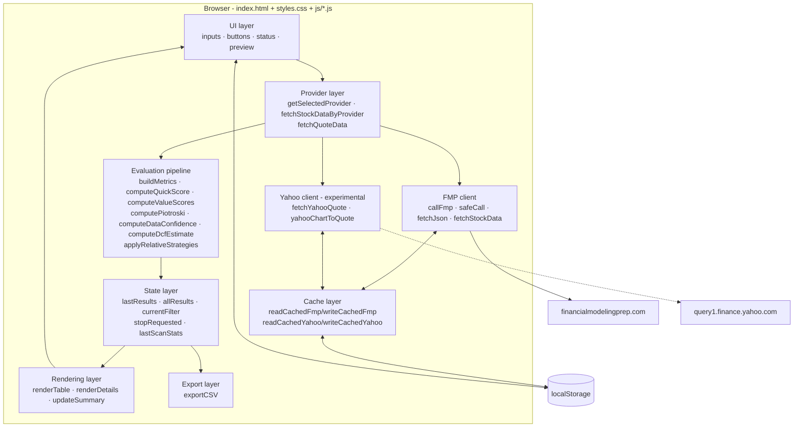
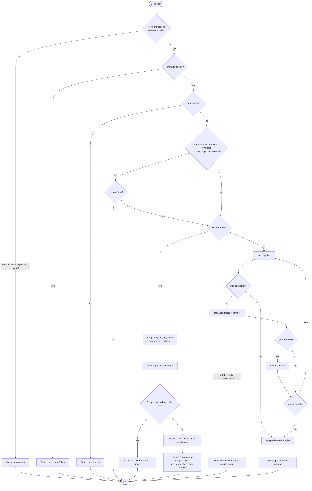

# Architecture

Last updated: 2026-10-08 (after PR #8: split into static files)

## 1. Current architecture: static files, no build

The app is a static frontend ([ADR-0004](decisions/ADR-0004-split-static-assets.md), which superseded the single-file [ADR-0001](decisions/ADR-0001-single-file-static-app.md) in PR #8):

| File | Contents |
| --- | --- |
| `index.html` | Markup only: header, settings card, DCF inputs, symbol textarea, action buttons, summary, results table (36 columns). Inline `onclick` / `onchange` / `oninput` handlers call global functions. |
| `styles.css` | CSS variables, card/grid layout, table, pills, responsive breakpoints |
| `js/constants.js` | Presets, FMP endpoints, providers, cache TTLs, scoring/DCF limits, Two-stage settings |
| `js/state.js` | Shared state: `lastResults`, `allResults`, `currentFilter`, `stopRequested`, `lastScanStats` |
| `js/utils.js` | Escaping, parsing, number helpers, formatting, math, input clamping |
| `js/cache.js` | localStorage cache (FMP + Yahoo), Clear Cache |
| `js/providers.js` | Provider selection, FMP client, Yahoo Experimental client, `fetchStockDataByProvider` |
| `js/metrics.js` | `buildMetrics`, derived metrics, Data Confidence |
| `js/dcf.js` | DCF estimate |
| `js/scoring.js` | Strategy scores, Piotroski, Dreman/Neff relative, total score and decision, `evaluateStock` |
| `js/render.js` | Status, request preview, pills, table, details, tabs, summary |
| `js/scan.js` | Request planning, `scanStocks`, Two-stage scan, stop, endpoint tests |
| `js/export.js` | `exportCSV` |
| `js/app.js` | `initializePage` and settings handlers. Loaded last; the only file that runs code at load time. |

The scripts are **classic scripts loaded with `defer` in the order above**. They share one global scope, so functions in one file can call functions in another at runtime. There is no `package.json`, build step, bundler, transpiler, module system, backend or external (CDN) script.

## 2. Browser-only runtime

The app runs entirely in the user's browser. Network calls go **directly** from the page to the data provider over HTTPS:

- **FMP** returns `Access-Control-Allow-Origin: *`, so browser calls work.
- **Yahoo's** chart endpoint does not send CORS headers, so browsers normally block reading the response. That is why the provider is experimental ([ADR-0002](decisions/ADR-0002-fmp-primary-provider.md)).

## 3. Layers

### UI layer

- **Settings:** provider, API key (FMP), preset list, scan mode, top-N, market-cap thresholds (US / non-US), minimum volume, minimum price, Two-stage settings (Stage 1 max symbols, Deep Scan Top N), DCF assumptions, and the symbol textarea.
- **Actions:** scan, stop, FMP endpoint test, selected-provider test, CSV export, clear cache, clear API key.
- **Feedback:** `#requestPreview`, `#status` (via `setStatus`), `#endpointStatus`, and `#providerWarning`, which is visible only for Yahoo.
- **RTL:** the page is `lang="he" dir="rtl"`. Symbol input and numbers are LTR.

### State layer

These module-level variables live only in memory:

| Variable | Meaning |
| --- | --- |
| `allResults` | All evaluated rows from the last scan, sorted by total score |
| `lastResults` | Top-N slice that is displayed and exported |
| `currentFilter` | Active table tab |
| `stopRequested` | Set by the stop button |
| `lastScanStats` | `{ checked, apiCalls, cacheHits, stopped, mode, twoStage? }`. `twoStage` holds the Stage 1 / Stage 2 counters for the summary line. |

These values are persisted in `localStorage`: the API key, the selected provider, and the cache entries.

### Provider layer

| Function | Role |
| --- | --- |
| `PROVIDERS` | `{ fmp: {label, supportsDeep: true, needsApiKey: true}, yahoo: {label, supportsDeep: false, needsApiKey: false} }` |
| `getSelectedProvider()` | Reads `#dataProvider` and falls back to `fmp` |
| `providerLabel(p)` | Display label |
| `fetchQuoteData(p, symbol, key)` | One quote, used by the selected-provider test |
| `fetchStockDataByProvider(symbol, key, mode, p)` | Scan entry point. FMP → `fetchStockData`. Yahoo → quote-only raw record. |

### FMP flow (Current)

1. `fetchStockData` calls `safeCall("/stable/quote")`.
2. In deep mode, it loops over `DEEP_ENDPOINTS` (9 endpoints) with a 70 ms delay between calls.
3. `safeCall` wraps `callFmp`, which checks the cache, builds the URL with `symbol`, `apikey` and the extra params, then calls `fetchJson`.
4. `fetchJson` handles errors:
   - **Rate limits** (HTTP 429 or limit text) throw `rateLimited`, which stops the scan.
   - **Restricted endpoints** throw an error that is recorded as missing data.

### Yahoo experimental flow

1. `fetchStockDataByProvider` throws if the mode is not `quick`. The UI blocks this case even earlier, in `scanStocks`.
2. `fetchYahooQuote` checks the cache, then GETs `v8/finance/chart/{symbol}?interval=1d&range=1y`.
3. Errors:
   - A network/CORS failure, 401 or 403 throws `providerBlocked`, which **stops the scan** so Yahoo isn't called repeatedly.
   - 429 goes through the rate-limit path.
   - Other errors are recorded per symbol.
4. `yahooChartToQuote` maps the response onto FMP quote field names, so `buildMetrics` works unchanged. Market cap is `null`.

### Cache layer

Entries are `{timestamp, data}` JSON in `localStorage`. FMP uses a 10-minute TTL for quotes and 7 days for everything else. Yahoo uses 10 minutes. See [SPEC §15](../SPEC.md#15-cache-behavior).

### Scan / evaluation pipeline

`scanStocks()`:

1. Validate the inputs.
2. Block Yahoo Deep Scan.
3. Require a key for FMP.
4. Confirm large FMP deep scans.
5. For each symbol:
   - Fetch the data.
   - Count API calls and cache hits.
   - Run `evaluateStock` if a quote exists.
6. `applyRelativeStrategies` runs across all rows: relative basis, Dreman, Neff, then the final total and decision.
7. Sort, slice to top-N, render, and update the summary.

In `twoStage` mode, `scanStocks` hands off to `runTwoStageScan()` after the same validation:

1. **Stage 1:**
   - Quick fetch for up to *Stage 1 max symbols*, then `evaluateStock`.
   - `rankStageOneCandidates` orders the rows (candidate ordering only).
2. **Stage 2:**
   - The top N candidates that pass `passBasic` get a deep fetch, reusing the cached Stage 1 quote, then `evaluateStock`.
   - `showTwoStageResults` applies `applyRelativeStrategies` to the Stage 2 rows only, then sorts and renders.
3. **Stop / rate limit:** the scan halts immediately. It shows the partial Stage 2 rows, or the preliminary Stage 1 rows labeled via `scanMeta.stage = 1`.

For Two-stage rows, `renderDetails` and the source column show `scanMeta`, and `#twoStageSummary` shows the stage counters.

### Rendering layer

- `renderTable` builds the 36-column table for the active tab.
- `renderDetails` builds the expandable per-row explanation.
- `updateSummary` fills the 5 summary boxes from `allResults`.
- All dynamic strings pass through `escapeHtml`.

### Export layer

`exportCSV` serializes `lastResults` into a Blob and triggers a download of `value_stock_finder_results.csv`.

## 4. Scan flow

## 5. Why there is no backend currently

- The app is a personal tool. A few static files are the simplest thing that works.
- FMP allows browser calls (CORS `*`).
- A backend adds hosting, cost, deployment and maintenance.
- The cost of this choice is that **API keys cannot be hidden**. That is accepted for local personal use and documented in [ADR-0003](decisions/ADR-0003-no-backend-yet.md) and [security.md](security.md).

## 6. Future architecture options (not implemented)

| Option | What it would enable | Cost |
| --- | --- | --- |
| ES modules (`type="module"`) instead of classic scripts | Explicit imports and exports, no shared globals | Inline handlers must be replaced; `file://` stops working. Needs a new ADR. (The static-file split itself is done: [ADR-0004](decisions/ADR-0004-split-static-assets.md).) |
| Small serverless proxy (e.g. Cloudflare Worker, Netlify Function) | Hide the FMP key, add CORS for other providers, server-side caching | Hosting, secrets management, abuse protection |
| Background / batch scanner | Market-wide universes, scheduled screens (the browser-side Two-stage scan already exists) | Needs storage and a backend |
| Provider plugin interface | Cleaner multi-provider support (TASE, global) | Refactor of the provider layer |
| Automated tests (headless browser or extracted pure functions) | Regression safety for scoring | Tooling. Must not add runtime dependencies. |

Any of these requires explicit user approval and a new ADR.
