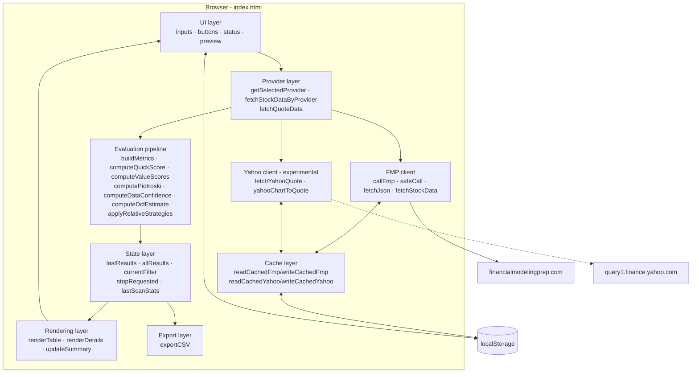
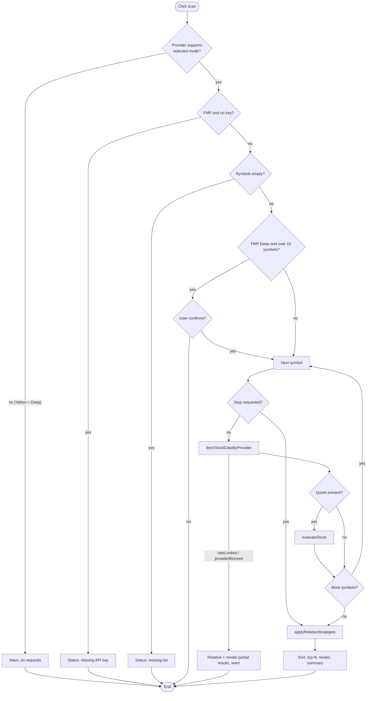

# Architecture

Last updated: 2026-10-08 (main at `09dbd5d`, after PR #3)

## 1. Current architecture: a single-file static app

Everything ships in **one file, `index.html`**:

| Part | Approx. location | Contents |
| --- | --- | --- |
| `<style>` | top of file | CSS variables, card/grid layout, table, pills, responsive breakpoints |
| Markup | `<header>`, `<main>` | Settings card, DCF inputs, symbol textarea, action buttons, summary, results table (36 columns) |
| `<script>` | bottom of file | All application logic as plain global functions. No modules, no framework. |

There is no `package.json`, build step, bundler, transpiler, backend or external script. The decision is recorded in [ADR-0001](decisions/ADR-0001-single-file-static-app.md).

## 2. Browser-only runtime

The app runs entirely in the user's browser. Network calls go **directly** from the page to the data provider over HTTPS:

- **FMP** returns `Access-Control-Allow-Origin: *`, so browser calls work.
- **Yahoo's** chart endpoint does not send CORS headers, so browsers normally block reading the response. That is why the provider is experimental ([ADR-0002](decisions/ADR-0002-fmp-primary-provider.md)).

## 3. Layers

### UI layer

- **Settings:** provider, API key (FMP), preset list, scan mode, top-N, market-cap thresholds (US / non-US), minimum volume, minimum price, DCF assumptions, and the symbol textarea.
- **Actions:** scan, stop, FMP endpoint test, selected-provider test, CSV export, clear cache, clear API key.
- **Feedback:** `#requestPreview`, `#status` (via `setStatus`), `#endpointStatus`, and `#providerWarning`, which is visible only for Yahoo.
- **RTL:** the page is `lang="he" dir="rtl"`. Symbol input and numbers are LTR.

### State layer

These module-level variables live only in memory:

| Variable | Meaning |
| --- | --- |
| `allResults` | All evaluated rows from the last scan, sorted by total score |
| `lastResults` | Top-N slice that is displayed and exported |
| `currentFilter` | Active table tab |
| `stopRequested` | Set by the stop button |
| `lastScanStats` | `{ checked, apiCalls, cacheHits, stopped }` |

These values are persisted in `localStorage`: the API key, the selected provider, and the cache entries.

### Provider layer

| Function | Role |
| --- | --- |
| `PROVIDERS` | `{ fmp: {label, supportsDeep: true, needsApiKey: true}, yahoo: {label, supportsDeep: false, needsApiKey: false} }` |
| `getSelectedProvider()` | Reads `#dataProvider` and falls back to `fmp` |
| `providerLabel(p)` | Display label |
| `fetchQuoteData(p, symbol, key)` | One quote, used by the selected-provider test |
| `fetchStockDataByProvider(symbol, key, mode, p)` | Scan entry point. FMP → `fetchStockData`. Yahoo → quote-only raw record. |

### FMP flow (Current)

1. `fetchStockData` calls `safeCall("/stable/quote")`.
2. In deep mode, it loops over `DEEP_ENDPOINTS` (9 endpoints) with a 70 ms delay between calls.
3. `safeCall` wraps `callFmp`, which checks the cache, builds the URL with `symbol`, `apikey` and the extra params, then calls `fetchJson`.
4. `fetchJson` handles errors:
   - **Rate limits** (HTTP 429 or limit text) throw `rateLimited`, which stops the scan.
   - **Restricted endpoints** throw an error that is recorded as missing data.

### Yahoo experimental flow

1. `fetchStockDataByProvider` throws if the mode is not `quick`. The UI blocks this case even earlier, in `scanStocks`.
2. `fetchYahooQuote` checks the cache, then GETs `v8/finance/chart/{symbol}?interval=1d&range=1y`.
3. Errors:
   - A network/CORS failure, 401 or 403 throws `providerBlocked`, which **stops the scan** so Yahoo isn't called repeatedly.
   - 429 goes through the rate-limit path.
   - Other errors are recorded per symbol.
4. `yahooChartToQuote` maps the response onto FMP quote field names, so `buildMetrics` works unchanged. Market cap is `null`.

### Cache layer

Entries are `{timestamp, data}` JSON in `localStorage`. FMP uses a 10-minute TTL for quotes and 7 days for everything else. Yahoo uses 10 minutes. See [SPEC §15](../SPEC.md#15-cache-behavior).

### Scan / evaluation pipeline

`scanStocks()`:

1. Validate the inputs.
2. Block Yahoo Deep Scan.
3. Require a key for FMP.
4. Confirm large FMP deep scans.
5. For each symbol:
   - Fetch the data.
   - Count API calls and cache hits.
   - Run `evaluateStock` if a quote exists.
6. `applyRelativeStrategies` runs across all rows: relative basis, Dreman, Neff, then the final total and decision.
7. Sort, slice to top-N, render, and update the summary.

### Rendering layer

- `renderTable` builds the 36-column table for the active tab.
- `renderDetails` builds the expandable per-row explanation.
- `updateSummary` fills the 5 summary boxes from `allResults`.
- All dynamic strings pass through `escapeHtml`.

### Export layer

`exportCSV` serializes `lastResults` into a Blob and triggers a download of `value_stock_finder_results.csv`.

## 4. Scan flow

## 5. Why there is no backend currently

- The app is a personal tool. One HTML file is the simplest thing that works.
- FMP allows browser calls (CORS `*`).
- A backend adds hosting, cost, deployment and maintenance.
- The cost of this choice is that **API keys cannot be hidden**. That is accepted for local personal use and documented in [ADR-0003](decisions/ADR-0003-no-backend-yet.md) and [security.md](security.md).

## 6. Future architecture options (not implemented)

| Option | What it would enable | Cost |
| --- | --- | --- |
| Split into `index.html` + `app.js` + `styles.css` (still static) | Easier reviews and diffs | Needs a new ADR. Breaks "single file". |
| Small serverless proxy (e.g. Cloudflare Worker, Netlify Function) | Hide the FMP key, add CORS for other providers, server-side caching | Hosting, secrets management, abuse protection |
| Background / batch scanner | Large universes, scheduled screens | Needs storage and a backend |
| Provider plugin interface | Cleaner multi-provider support (TASE, global) | Refactor of the provider layer |
| Automated tests (headless browser or extracted pure functions) | Regression safety for scoring | Tooling. Must not add runtime dependencies. |

Any of these requires explicit user approval and a new ADR.
