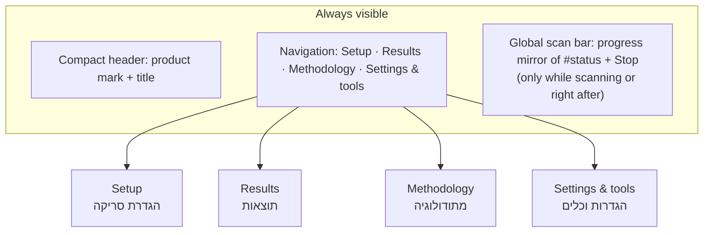

# ADR-0005: App shell and multi-screen navigation plan

## Status

**Accepted.** Planned in PR #10 (2026-10-09). **Stage 1 (Setup + Results, global scan bar) implemented in PR #11.** Methodology, Results UX and Settings & tools are still planned. Since PR #12 was used for the row details dialog and XLSX/PDF exports ([ADR-0006](ADR-0006-export-dependencies.md)), those stages shift to PRs #13–#15 (see [roadmap.md](../roadmap.md)). The PR numbers in the plan below are the original ones.

## Context

After PR #9 the app is one long, well-organized page, top to bottom:

- hero
- workflow strip
- five settings groups
- the action dock
- the summary
- the 36-column results table

It works, but it is reaching the limits of a single page:

- **Two jobs, one page.** Setting up a scan and reading the results are different tasks. The results sit far below the fold after a long settings form, and the settings sit far above the table while you study it.
- **Feedback lives in one place.** `setStatus()` writes only `#status`, and the only Stop control is `#stopButton`. Both are in the action dock. Anyone who scrolls down to the results during a scan loses sight of progress and of the Stop button.
- **Tools mixed with the flow.** Maintenance tools (endpoint tests, clear cache, clear API key) share space with the main flow.
- **No home for methodology.** The educational methodology lives only in `docs/`, so there is no in-app place to explain what the scores mean.
- **Growing UI.** More UI is planned (methodology, a richer results view), and adding it to one page would make the page longer still.

The architecture constraints from ADR-0001, [ADR-0003](ADR-0003-no-backend-yet.md) and [ADR-0004](ADR-0004-split-static-assets.md) still hold: a static frontend, classic deferred scripts, global functions called from inline handlers, no build step, no dependencies and no backend.

### What the current code allows (inspected for this ADR)

| Fact | Consequence for an app shell |
| --- | --- |
| All JS reads settings via `document.getElementById(id).value` | A control can live on a hidden screen and still feed the scan. Hiding is safe; **removing or renaming is not.** |
| `setStatus()` writes `#status`; `scanStocks()` toggles `#scanButton.disabled` and `#stopButton.disabled` | The shell can tell whether a scan is running by watching `#scanButton`'s `disabled` attribute, and can mirror `#status` text. **No existing JS changes are needed.** |
| Results render into `#stocksTable`, `#twoStageSummary` and the summary-tile IDs | The Results screen can contain these exact elements, moved but unchanged |
| The existing workflow strip uses hash anchors `#sec-source`, `#sec-universe`, `#sec-scan`, `#sec-results` | A router must not break them. Plain element-ID hashes need to keep working. |
| The only `localStorage` keys are `valueStockFinderApiKey`, `valueStockFinderProvider`, `valueStockFinderFmpCache:*`, `valueStockFinderYahooCache:*` | The shell must not rename them, and should not need new keys |
| ADR-0004: only `js/app.js` runs code at load time | The shell's own init needs either a documented exception or a one-line call from `app.js`. See the decision. |

## Decision

Adopt a **lightweight static app shell with client-side screen navigation** (option B below):

- no framework, no router library, no build step
- implemented in stages, starting with PR #11
- screens are plain `<section>` elements already in `index.html`
- exactly one screen is visible at a time
- the active screen is chosen by the URL hash
- one small new classic script, `js/shell.js`, handles routing and the global scan bar
- **all existing controls, IDs, handlers, `localStorage` keys and scan/scoring code stay exactly as they are**

`js/shell.js` is loaded **after** `js/app.js` and initializes itself. That is a deliberate, documented exception to ADR-0004's "only `app.js` runs code at load time" rule, chosen so that no existing JS file has to change. The alternative, a one-line `initShell()` call at the end of `app.js`, is acceptable if the owner prefers to keep the rule absolute.

## Recommended information architecture



| Screen | Route | Contains (existing elements, moved not changed) | Notes |
| --- | --- | --- | --- |
| **Setup** (default) | `#/setup` | Hero (full size), workflow strip, data source (`dataProvider`, `apiKey`, `providerWarning`), stocks (`presetList`, `symbolsInput`), scan mode (`scanMode`, `topLimit`, `twoStageMaxSymbols`, `twoStageTopN`), basic filters, DCF assumptions, action dock (`scanButton`, `stopButton`, `requestPreview`, `status`) | **The API key stays here.** A first-time user cannot scan without it, so it must not be hidden on another screen. |
| **Results** | `#/results` | Summary tiles (`checkedCount` … `bestStock`), `twoStageSummary`, filter tabs (`tabAll` … `tabReject`), `stocksTable`, plus the **Export CSV** button moved here (same `onclick="exportCSV()"`) | Before any scan: an empty state with a "Go to setup" link |
| **Methodology** | `#/methodology` | New, read-only educational content: what each strategy column checks, how to read scores, Data Confidence, DCF and margin of safety, the Two-stage ordering bias, the disclaimer. Links to `docs/investment-methodology.md` | No numeric thresholds in the app UI. The docs stay the single source of truth for them (see risks). |
| **Settings & tools** | `#/settings` | Endpoint tests (`testEndpoints`, `testSelectedProvider`, `endpointStatus`), Clear Cache, Clear saved API key, a plain explanation of what is stored in `localStorage` and the static-key limitation, and the Yahoo experimental note | Maintenance only, never required for a normal scan |

**Why the API key stays in Setup.** The PR #10 brief suggested putting it under Settings/API. I recommend against that: the key is a precondition of the main flow, and hiding it behind a fourth tab would make the first run fail with "חסר API Key" and no visible field. Settings holds *key management* (clear, explain); Setup holds *key entry*.

**Global elements**

- **Compact header:** the product mark and title. The full hero shows only on Setup.
- **Navigation:**
  - Desktop: a segmented control under the header.
  - Phones (≤ 650 px): a bottom tab bar with the four icons from the existing sprite plus labels, with safe-area padding and 44 px targets.
  - The order follows the RTL reading direction: Setup is first, on the right.
- **Global scan bar:**
  - **Visibility:** shown on every screen while a scan runs, i.e. while `#scanButton` is disabled.
  - **Contents:** it mirrors the text of `#status`, and has a Stop button that calls the existing `requestStopScan()`. That button has no ID, so nothing duplicates `#stopButton`.
  - **When a scan finishes:** the bar shows "Results ready" with a link to `#/results`, and the Results tab gets a small dot.
  - **No auto-navigation.** The app does not jump to Results, because a sudden screen switch is disorienting and can hide the final status message.
- **Footer disclaimer:** "educational tool, not investment advice" on every screen.

**Wireframes (RTL, desktop)**

```
┌──────────────────────────────────────────────────────────────┐
│               Value Stock Finder  [mark]                    │  compact header
│   [Settings & tools] [Methodology] [Results •] [Setup]       │  segmented nav (Setup is first, on the right)
├──────────────────────────────────────────────────────────────┤
│ ◐ Stage 2 (Deep Scan): 3/10: KO …                   [Stop]   │  global scan bar (only while scanning)
├──────────────────────────────────────────────────────────────┤
│                          (active screen)                     │
└──────────────────────────────────────────────────────────────┘

Phone (≤650 px):  content scrolls; floating bottom tab bar:
   ( Settings )( Methodology )( Results • )( Setup )
```

**Routing rules (hash only, no History API)**

1. `#/setup`, `#/results`, `#/methodology`, `#/settings`: show that screen and hide the others (the `hidden` attribute).
2. Empty or unknown hash: show Setup.
3. **Element hash** (for example the existing `#sec-scan`, or any element ID): show the screen that contains that element, then scroll to it. This keeps today's workflow-strip anchors and any bookmarked anchors working.
4. Listen to `hashchange`, so the browser Back/Forward buttons move between screens.
5. Update `aria-current="page"` on the nav and `document.title` (for example "תוצאות · Value Stock Finder"). Move focus to the new screen's heading (`tabindex="-1"`).
6. Hash routing works over `file://`, `http.server` and GitHub Pages. No server configuration is needed.

## Alternatives considered

### Option A: keep one page and improve in-page navigation

Add a sticky section nav or table-of-contents, plus the global scan bar, but keep one long page.

- **Pros:** the smallest change, with no hidden content and nothing to route. Ctrl+F and printing still see everything.
- **Cons:** the two jobs still compete on one page. The results stay far from the controls on long forms. Methodology content would make the page longer. The table still lives below a large form.
- **When it is enough:** if no methodology screen is planned and results stay small. Neither is true for the roadmap.

**Partly adopted:** the global scan bar and the element-hash anchors from this option are kept inside option B.

### Option B: lightweight static app shell (recommended)

Use the screens and hash routing described above.

- **Pros:**
  - Each screen has one job (the Apple "one idea per screen" principle).
  - Results get the full viewport.
  - Methodology and tools get proper homes.
  - It stays static, needs no new dependency, and works over `file://`.
  - It is fully reversible: deleting `js/shell.js` and the wrapper classes gives back today's single page.
- **Cons:**
  - Some content is hidden at any moment, which needs the global scan bar and clear nav state.
  - Ctrl+F finds only the visible screen.
  - One more script, and a load-order exception (or a one-line `app.js` change).
- **Implementation complexity:** low to moderate. Roughly 120–200 lines of `shell.js`, wrapper markup and CSS. The tricky parts are the scan-bar mirror, focus handling and element-hash resolution, and all of them are testable in a browser.

### Option C: full router or framework (React/Vite/Next, or a router library)

- **Pros:** component structure, nested routes and the ecosystem.
- **Cons:**
  - It contradicts the project's constraints: no dependencies, no build, classic scripts and inline handlers (ADR-0004).
  - It would mean rewriting working, verified code (scan, scoring, rendering) into components.
  - It adds supply-chain and maintenance cost.
  - `file://` use would break.
- **Why not now:** the app has four screens and no nested state. A hash listener and the `hidden` attribute cover it completely. Reconsider only if the app needs user accounts, a backend ([ADR-0003](ADR-0003-no-backend-yet.md)) or many dynamic views, and only through a new ADR.

## Implementation plan (staged; each PR independently reviewable and revertible)

| PR | Milestone | Scope | Explicitly not in scope |
| --- | --- | --- | --- |
| **#11** | App shell: Setup + Results | <ul><li>`js/shell.js` (router, nav, global scan bar, focus and title handling) and its `<script defer>` tag after `app.js`</li><li>Compact header and nav (segmented control on desktop, bottom tab bar on phones)</li><li>Wrap today's settings and action dock in the Setup screen, and the summary and table in the Results screen</li><li>Move the Export CSV button to Results</li><li>Methodology and Settings tabs are **not** added yet: no empty screens</li><li>Update the script-order check in AGENTS.md and verification.md to include `shell`</li></ul> | Any change to existing JS, IDs, handlers, scan, scoring or CSV |
| **#12** | Methodology screen | <ul><li>`#/methodology` with plain-language summaries of each strategy column, Data Confidence, DCF and margin of safety, and the Two-stage ordering bias</li><li>The disclaimer</li><li>Links to `docs/investment-methodology.md`</li></ul> | Numeric thresholds in the UI (they stay in docs) and scoring changes |
| **#13** | Results UX refinement | <ul><li>A sticky summary or table toolbar</li><li>An "N of M shown" note (display limit)</li><li>Better empty and preliminary (Stage 1-only) states</li><li>Column-group hints</li></ul> | Column, CSV or scoring changes |
| **#14** | Settings & tools screen | <ul><li>`#/settings`: move the endpoint tests, Clear Cache and Clear saved API key there, with the storage explanation and the Yahoo note</li><li>Setup keeps key entry</li></ul> | Changing `localStorage` keys or provider behavior |

**Why this order:** PR #11 delivers the structural benefit (setup and results separated, scan feedback global) with the smallest new surface. Methodology (#12) adds new value without moving any controls. Moving the maintenance tools (#14) is the least valuable change, and it touches destructive actions, so it goes last, after the shell has settled.

## Constraints (all future implementation PRs)

- Static frontend only. No backend, no dependencies, no build tools, no framework or router library.
- Classic scripts loaded with `defer`. `js/shell.js` is the only new script. The existing 12 files are unchanged unless a later PR explicitly justifies a change.
- **Preserve these IDs exactly**, with each present exactly once:
  - Data source and stocks: `dataProvider`, `apiKey`, `presetList`, `symbolsInput`
  - Scan mode: `scanMode`, `topLimit`, `twoStageMaxSymbols`, `twoStageTopN`
  - Basic filters: `marketCapUS`, `marketCapDefault`, `volumeMin`, `priceMin`
  - DCF: `dcfDiscountRate`, `dcfTerminalGrowth`, `dcfProjectionYears`, `dcfMarginSafety`
  - Actions and feedback: `scanButton`, `stopButton`, `requestPreview`, `status`, `endpointStatus`
  - Results: `twoStageSummary`, `stocksTable`
  - Also: `providerWarning`, the summary-tile IDs and the tab IDs
- **Preserve these global functions and their inline handlers:**
  - Setup: `onProviderChange`, `loadPresetList`, `updateRequestPreview`
  - Scanning: `scanStocks`, `requestStopScan`
  - Tests: `testEndpoints`, `testSelectedProvider`
  - Results and tools: `exportCSV`, `clearCache`, `clearApiKey`, `setTableFilter`
- Do not rename, remove or add to the `localStorage` keys. The route lives only in the URL hash.
- CSV stays at 44 columns and the results table at 36 unless a future feature PR changes them explicitly.
- FMP stays the default provider. Yahoo stays Experimental / Browser test only, and blocked for Deep Scan and Two-stage.
- New element IDs must not collide with existing ones. Proposed prefix: `shell-`.
- Respect `prefers-reduced-motion` (no screen transition animation). Keyboard and screen-reader navigation must work (`aria-current`, focus on the heading, visible focus rings).

## Risks

| Risk | Mitigation |
| --- | --- |
| **Breaking IDs or handlers while moving markup** | The same scripted check as PR #9: every control's attributes are identical to `main` except `class`, options and headers are identical, and original IDs are present once. Handler-resolution check in the browser. |
| **Hidden controls that still affect scans** (for example, filters changed on Setup, then scanning while Setup is hidden) | Scans start only from Setup, and the hidden values are read exactly as today. The Results screen shows the scan mode and the display limit used. Verification includes changing a filter, switching screens and confirming it still applies. |
| **Losing scan feedback or Stop on another screen** | A global scan bar that mirrors `#status` and calls `requestStopScan()`. Tested by starting a mocked scan and stopping it from Results. |
| **Changing `localStorage` behavior** | The shell uses no storage. Verification compares the storage keys before and after navigation and scans. |
| **The table getting harder to use** | Results gets the full width, and the table still scrolls only inside `.table-wrap`. The 375/424/1280 px checks continue. |
| **Navigation feeling like a different app** | Same visual identity (PR #9), same labels. The workflow strip remains on Setup. There is no auto-navigation, and a gentle "Results ready" cue instead. |
| **Existing `#sec-*` anchors and bookmarks breaking** | Routing rule 3 (element hash: owning screen, then scroll) |
| **Load-order exception confusing agents** | ADR-0004 is referenced and AGENTS.md/CLAUDE.md are updated in PR #11. The script-order check includes `shell` last. |
| **Methodology text drifting from the code** | No numeric thresholds in the UI. It links to `docs/investment-methodology.md`, which remains the source of truth (updated in the same PR as any rule change, per AGENTS.md). |
| **Ctrl+F and printing see only one screen** | Accepted trade-off. Documented in the user guide. |

## Verification plan (for PR #11 onward)

1. **Static:** `node --check` passes for every `js/*.js` file. The script-order check passes, updated to `[... "app", "shell"]`. `git diff --check` is clean. The secret scan is clean. No dependencies.
2. **No regression in existing code:** `git diff main -- js/` shows only the new `js/shell.js` (no edits to the 12 existing files, unless justified).
3. **DOM preservation script (from PR #9):**
   - controls identical to `main` except `class`
   - options identical
   - 36 identical headers
   - all original IDs present once
   - new IDs only use the `shell-` prefix
4. **Routing (browser):**
   - each route shows exactly one screen
   - an empty or unknown hash gives Setup
   - `#sec-*` anchors open the right screen and scroll
   - Back/Forward work
   - `aria-current` and `document.title` update
   - focus moves to the heading
   - this works over both `http://localhost:8000` and `file://`
5. **Behavior (mocked FMP, one scan per run, no real key):**
   - Deep Scan: 10 calls per symbol
   - Momentum: 1 call per symbol
   - Two-stage: Stage 1 quote-only, Stage 2 deep
   - Yahoo + Deep Scan / Two-stage: 0 requests
   - CSV: 44 columns. Table rows: 36 cells.
6. **Shell-specific:**
   - The scan bar appears during a scan on every screen and mirrors `#status`.
   - Stop from the Results screen halts the scan.
   - The "Results ready" cue appears.
   - No auto-navigation happens.
   - The `localStorage` keys are unchanged after navigating and scanning.
7. **Responsive and accessibility:**
   - 1280 / 424 / 375 px: no page overflow, the bottom tab bar doesn't cover content, and the table scrolls inside its wrapper
   - keyboard-only navigation works
   - WCAG AA contrast
   - reduced motion respected

## Non-goals

- **PR #10:** no app shell implementation (no change to `index.html`, `styles.css` or `js/`).
- **All PRs:** no scoring, DCF, provider, scan, cache, CSV or table changes.
- No backend, no dependencies, no build tooling, no framework or router library.
- No new `localStorage` keys.
- No auto-navigation, animated page transitions or multi-window behavior.
