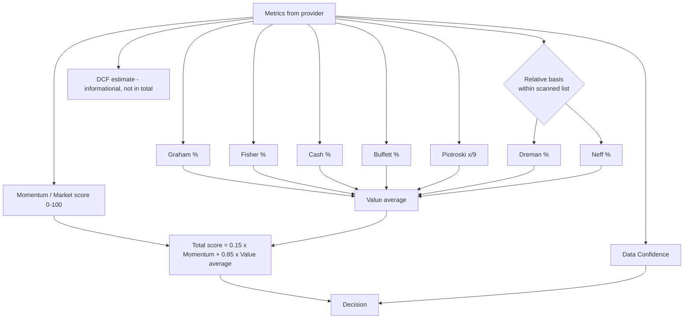

# Investment Methodology

Last updated: 2026-10-08 (documentation foundation, after PR #3)

> ⚠️ **Educational disclaimer.** This document describes the mechanical rules Value Stock Finder applies. The rules are **inspired by** well-known investors and by a value-investing course summary. They **do not exactly reproduce** any professional, published or proprietary strategy. Nothing here is investment advice, and no score implies that a stock is good, bad, cheap or expensive in any absolute sense.

All thresholds below are taken from the current `index.html`. If code and document ever disagree, the code is what runs, and the document must be fixed in the same PR as any rule change (see [AGENTS.md](../AGENTS.md)).

---

## 1. How scoring works



### Per-category percentage

Each check is a pass/fail **test** with a point weight (usually 1, sometimes 2).

- If the data for a test is missing, the test is **excluded** (shown as ⚪ "חסר נתון"). It is not counted as a fail.
- Category % = points earned ÷ points available, counting only the tests that could be evaluated.
- If no test in a category can be evaluated, the category shows **"חסר"** (missing) and is left out of the average.

**Consequence:** a category with only one evaluable test can show 0% or 100%. **Data Confidence** (section 10) exists to flag this.

### Total score and decision

1. `Value average` = the mean of the available category percentages: Graham, Fisher, Cash, Buffett, Piotroski (score ÷ 9), Dreman, Neff.
2. `Total score = round(0.15 × Momentum + 0.85 × Value average)`.
3. **Basic filter** (`passBasic`): price ≥ minimum price (default $5), volume ≥ minimum volume (default 100,000), and market cap ≥ the threshold (default US $2B, non-US $1B).
4. Decision:

| Decision | Condition |
| --- | --- |
| **מועמדת חזקה** (Strong Candidate) | passBasic **and** Data Confidence strong enough **and** total ≥ 75 **and** (Cash % ≥ 60 or Cash missing) |
| **Watchlist** | passBasic and total ≥ 55 |
| **בדיקה ידנית** (manual review) | passBasic, total < 55 |
| **נפסלה** (Rejected) | fails passBasic |

"US-listed" is a heuristic: the exchange name contains `nasdaq`, `nyse`, `amex`, `arca`, `cboe` or `us`.

> The DCF result does **not** feed the total score or the decision. It is shown alongside them.

---

## 2. Momentum / Market (quick score)

This is not a value strategy. It is a quote-only snapshot available in both scan modes. Points are capped at 100.

| Signal | Points |
| --- | --- |
| Market cap > $200B / > $10B / > $2B | 20 / 14 / 8 |
| Volume > 20M / > 1M / > 100K | 18 / 12 / 6 |
| Price above 50-day average | 15 |
| Price above 200-day average | 20 |
| Daily change > 3% / > 0% | 10 / 5 |
| Position in 52-week range > 85% / > 65% / > 50% | 17 / 11 / 5 |

---

## 3. Graham-inspired

Benjamin Graham's defensive-investor ideas: adequate size, a strong balance sheet, a moderate price and earnings growth.

| Test | Rule | Points |
| --- | --- | --- |
| Revenue | Latest annual revenue > $350M | 1 |
| Current ratio | > 2 | 1 |
| Working capital vs LTD | (Current assets − current liabilities) > long-term debt | 1 |
| P/E range | 5 < P/E < 15 (**< 25 for tech/pharma/healthcare**) | 1 |
| Graham ratio | P/E × P/B < 22 | 1 |
| EPS total growth | Average EPS of the last 2 years vs the first 2 years (needs ≥ 4 years) > +30% | 1 |

**Approximation notes:** the course and Graham's books use multi-decade earnings and dividend records. The app uses at most 5 annual statements. The tech/pharma P/E relaxation is a course-style adjustment, not Graham's original rule. Tech/pharma is detected by keywords (technology, software, semiconductor, pharma, biotech, healthcare) in sector, industry, exchange or name.

## 4. Fisher-inspired

Philip Fisher's quality-growth lens, reduced to measurable proxies.

| Test | Rule | Points |
| --- | --- | --- |
| Cheap on 2 of 3 | At least 2 of: P/E < 15 (25 tech/pharma), P/E × P/B < 22, P/S < 1.5 | 2 |
| Profit margin | Net margin > 8% (**> 15% tech/pharma**) | 1 |
| EPS CAGR | Annual EPS CAGR > 15% (needs ≥ 4 annual EPS values; first and last must be positive) | 1 |
| Debt/Equity | < 0.4 | 1 |
| FCF per share | > 0 | 1 |

**Approximation notes:** Fisher's method is mostly qualitative ("scuttlebutt", management quality, R&D). None of that can be automated, so this column only covers the quantitative remainder. In the "2 of 3" test, a missing multiple counts as *not cheap*, and the test itself is always evaluated.

## 5. Cash Flow quality

| Test | Rule | Points |
| --- | --- | --- |
| OCF > 0 | Operating cash flow positive | 1 |
| ICF < 0 | Investing cash flow negative (the company is investing) | 1 |
| CFF < 0 | Financing cash flow negative (repaying or returning capital) | 1 |
| OCF ≥ Net income | Earnings backed by cash | 2 |
| FCF > 0 | Free cash flow positive | 1 |
| Sloan ratio | (NI − OCF − ICF) ÷ total assets between −10% and +10% | 1 |

## 6. Buffett-inspired

| Test | Rule | Points |
| --- | --- | --- |
| EPS CAGR | > 0 | 1 |
| ROE | > 15% | 2 |
| ROA | > 12% | 1 |
| FCF | > 0 | 1 |
| 5Y earnings vs debt | Sum of up to 5 years of net income > long-term debt | 2 |

**Approximation notes:** Buffett's approach centers on durable competitive advantage, management and price relative to intrinsic value. This column checks only measurable quality signals.

## 7. Piotroski F-score (approximate)

This needs at least 2 years of income and balance-sheet data, otherwise the column shows "חסר". It compares the latest year (y0) to the prior year (y1).

| # | Test |
| --- | --- |
| 1 | ROA (NI ÷ assets) > 0 |
| 2 | ROA improved |
| 3 | OCF > 0 |
| 4 | OCF ≥ net income |
| 5 | Long-term debt ÷ assets decreased |
| 6 | Current ratio improved |
| 7 | No share dilution (shares y0 ≤ y1) |
| 8 | Gross margin improved |
| 9 | Asset turnover improved |

The score is shown as `x/9`: ≥ 7 green, ≥ 5 amber, otherwise red. **Approximation notes:** Piotroski's original definitions (for example, beginning-of-year assets and equity-issuance tests) are simplified here. A missing test counts as 0 out of 9, unlike the other categories, where missing tests are excluded.

## 8. Relative strategies: Dreman and Neff

### How relative comparisons work today

Dreman and Neff compare a stock with **peers inside the current scan only**:

1. **Industry peers in scanned list:** used if at least 3 other scanned stocks share the industry.
2. Otherwise **Sector peers in scanned list:** used if at least 3 share the sector.
3. Otherwise **Scanned list fallback:** all other scanned stocks.

The peer reference value is the **mean of positive values** among those peers. The basis label and peer count appear in the **Relative Basis** column. This is **not** a true industry or market average. Scanning 10 tech stocks means a stock is compared against those 9 others. Industry and sector come from the FMP profile, so Momentum-only scans and Yahoo always fall back to the scanned list.

### Dreman-inspired / Relative

David Dreman's contrarian low-multiple approach.

| Test | Rule | Points |
| --- | --- | --- |
| 2 cheap multiples | At least 2 of: P/E ≤ 80% of peer avg, P/B ≤ 80% of peer avg, P/OCF ≤ 80% of peer avg, dividend yield ≥ peer avg | 2 |
| Market cap | ≥ US or non-US threshold (from settings) | 1 |
| Current ratio | > 2 | 1 |
| Dividend yield | ≥ peer average | 1 |
| ROE | > 10% | 1 |
| Debt/Equity | < 0.5 | 1 |
| EPS CAGR | > 0 | 1 |

### John Neff-inspired / Relative

John Neff's low-P/E, moderate-growth, total-return approach.

| Test | Rule | Points |
| --- | --- | --- |
| Very low P/E | P/E ≤ 60% of peer average | 2 |
| Moderate growth | 7% ≤ EPS CAGR ≤ 22% | 2 |
| Revenue backs growth | Revenue growth ÷ EPS CAGR > 0.7 | 1 |
| FCF | > 0 | 1 |
| Total return / P/E | ((EPS CAGR + dividend yield) × 100) ÷ P/E ≥ 2 | 1 |
| Dividend | Yield ≥ 4% | 1 |

---

## 9. DCF / Estimated Fair Value and Margin of Safety

A simple free-cash-flow-to-equity-style DCF. It is **educational only**.

| Input | Source / default |
| --- | --- |
| Base FCF | Average of up to 5 annual FCF values (needs ≥ 2), else the latest FCF |
| Growth rate | First available of: historical FCF CAGR → FMP FCF growth → revenue growth. **Clamped to 0%–8%.** 0% if none. |
| Discount rate | 10% (editable, 1–30) |
| Terminal growth | 2.5% (editable, 0–8) |
| Projection years | 5 (editable, 1–10) |
| Required margin of safety | 25% (editable, 0–80) |

Calculation:

```text
FCF_t           = BaseFCF × (1 + g)^t                       for t = 1..N
PV(explicit)    = Σ FCF_t / (1 + r)^t
TerminalValue   = FCF_N × (1 + tg) / (r − tg)
PV(terminal)    = TerminalValue / (1 + r)^N
FairValue/share = (PV(explicit) + PV(terminal)) / SharesOutstanding
Upside          = FairValue / Price − 1
Discount (MoS)  = (FairValue − Price) / FairValue
MoS passed      = Discount ≥ required margin of safety
```

**Not calculable** ("Not enough data" / "חסר נתון") when the discount rate ≤ terminal growth, base FCF is missing or ≤ 0, or shares outstanding are missing.

**DCF Confidence** is the share of these 6 conditions that hold: r > tg, FCF > 0, shares present, price present, ≥ 3 years of FCF, and a growth input present.

**Known simplifications:** no adjustment for net debt or cash, no per-share dilution forecast, and one growth rate for all projection years. The 8% cap and 0% floor are deliberately conservative. The result is very sensitive to the discount rate and terminal growth.

## 10. Data Confidence

The share of these 19 fields that are present: Price\*, Market Cap\*, Volume\*, P/E, P/S, P/B, ROE, ROA, Debt/Equity, Current Ratio, Revenue, Net Income, Operating Cash Flow, Free Cash Flow, Total Assets, Long-Term Debt, Current Assets, Current Liabilities, Shares Outstanding.

\* Core fields. **Strong enough** = at least 70% present **and** no core field missing. Only stocks that are strong enough can be labeled Strong Candidate.

---

## 11. Exact course criteria vs. this implementation

| Aspect | Course / original idea | This app |
| --- | --- | --- |
| History length | Often 10+ years | ≤ 5 annual periods (FMP `limit=5`) |
| Industry averages | True industry or market averages | Mean of peers **within the scanned list** |
| Qualitative factors | Management, moat, products | Not modeled |
| Valuation | Analyst judgement | Mechanical DCF with capped growth |
| Missing data | Analyst investigates | The test is excluded, or the column shows "חסר" |

## 12. Known limitations in financial data

- Field names and definitions vary between FMP endpoints and plans. The app tries several aliases per field.
- TTM ratios and annual statements can come from different periods.
- Some endpoints are restricted on lower FMP plans, which leaves whole categories empty.
- Ratios may be decimals (0.15) or percentages (15). The display assumes values with |x| ≤ 1 are decimals.
- Non-US companies may report in other currencies. The app does no FX conversion.
- Cached fundamentals can be up to 7 days old, and cached quotes up to 10 minutes old.

**This app does not claim to exactly reproduce Graham, Fisher, Dreman, Neff, Piotroski, Buffett or any course methodology.** It is a transparent checklist tool for learning and first-pass screening.
