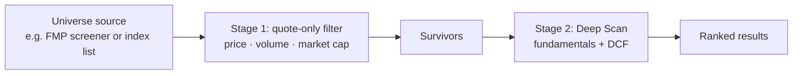

# Product Requirements

Last updated: 2026-10-08

> Value Stock Finder is an educational, personal research tool. It is not investment advice.

## 1. Vision

Give an individual value investor a **transparent, one-file screener** that applies course-style value checklists to any list of stocks in minutes. It shows exactly why each company passed, failed, or couldn't be evaluated, so human research starts from a short, well-explained list.

## 2. Personas

| Persona | Description | Needs |
| --- | --- | --- |
| **The course student** (primary) | Learning value investing from a course summary; Hebrew speaker | See course rules applied to real companies; understand each check |
| **The self-directed investor** | Maintains a personal watchlist | Re-screen a watchlist quickly, export for notes |
| **The tinkerer / developer** | Extends the tool with AI agents | Clear docs, safe constraints, easy verification |

## 3. Use cases

1. Screen a preset list of large US companies with a Deep Scan.
2. Check a handful of manually typed symbols.
3. Run a cheap Momentum-only pass to save API calls.
4. Compare the DCF fair value with the current price for educational insight.
5. Export the results to CSV for a spreadsheet or journal.
6. Find out which FMP endpoints the current plan allows.

## 4. User stories and acceptance criteria

| # | Story | Acceptance criteria (current behavior) |
| --- | --- | --- |
| US-1 | As a user, I want to enter my FMP key once. | The key is stored in `localStorage` after a scan or test and prefilled on reload. "Clear saved API key" removes it. |
| US-2 | As a user, I want to know how many API calls a scan will cost. | The preview shows the provider, total requests and expected cache hits. It updates when the symbols or mode change. |
| US-3 | As a user, I want to stop a long scan. | The stop button halts before the next symbol. Results collected so far are shown. |
| US-4 | As a user, I don't want to waste calls after hitting a rate limit. | On a rate limit, the scan stops with a warning and partial results. |
| US-5 | As a user, I want to see why a stock scored as it did. | Details list every test as ✅ / ❌ / ⚪ (missing), plus the relative basis, DCF inputs and reasons, and missing fields. |
| US-6 | As a user, I want to know when data is too thin. | The Data Confidence column appears. Strong Candidate requires ≥ 70% confidence and no missing core fields. |
| US-7 | As a user, I want an estimated fair value. | Fair Value, Upside, Discount, MoS and DCF Confidence columns appear. "Not enough data" is shown when inputs are missing. |
| US-8 | As a user, I want relative checks to be honest about the peer group. | The Relative Basis column shows industry, sector or scanned-list fallback, with the peer count. |
| US-9 | As a user, I want to try another provider without breaking anything. | Yahoo is selectable, clearly labeled experimental, Deep Scan is blocked, and failures show a clear message. FMP is unaffected. |
| US-10 | As a user, I want my results in a spreadsheet. | CSV with 44 columns, including DCF fields, `dataProvider` and Two-stage metadata at the end. |
| US-11 | As a user, I want to screen a larger list without paying for a Deep Scan of every symbol. | Two-stage scan: a quote-only Stage 1 over up to 200 symbols, then a Deep Scan of only the top N (≤ 30). The preview shows the per-stage call estimates. The final table shows the deep-scanned rows. Stop and rate limits keep partial results. |
| US-12 | As a user, I want ready-made larger lists. | Expanded US presets: Large Cap (90), Value (95), Dividend (60), curated and de-duplicated. |

## 5. Current scope

Everything listed as **Current** in [SPEC.md](../SPEC.md): FMP deep and quick scans, **Two-stage scan**, strategy scoring, DCF, data confidence, cache, preview, stop, rate-limit handling, endpoint tests, CSV, 4 US presets plus 3 expanded US presets, the manual list and Yahoo as an experimental quote-only provider.

## 6. Future scope (Planned / Future, not implemented)

| Item | Status | Notes |
| --- | --- | --- |
| Two-stage scan | **Current (PR #6)** | Quick pass on many symbols, then Deep Scan only on the top N |
| Larger universe: curated expanded presets | **Current (PR #6)** | US Large Cap 90, Value 95, Dividend 60 |
| Larger universe: automatic discovery | Planned | See §8 |
| Israel / TASE | Future | See §9 |
| All countries | Future | See §10 |
| Better provider abstraction | Planned | A provider interface with capabilities |
| Optional backend / proxy | Future | Only with explicit approval and an ADR |
| Tests / CI | Planned | Syntax + secret checks in CI; scoring unit tests |
| UI polish | Planned | Column grouping, explanations, screenshots |

## 7. UX principles

1. **Explain, don't verdict.** Every score can be expanded into its tests.
2. **Missing is visible.** Missing data shows as "חסר" or ⚪, never as a silent 0 (Piotroski is the documented exception).
3. **Cost-aware.** The user always sees the expected API usage before scanning.
4. **Safe by default.** FMP is the default. Experimental features are opt-in and loudly labeled.
5. **RTL-first.** Hebrew UI, LTR for symbols and numbers.
6. **Zero setup.** Opening the file is enough.

## 8. Large-universe scanning plan

**Current (PR #6):** Two-stage scan and curated expanded presets. Stage 1 is quote-only, and Stage 2 deep-scans only the top N. See [SPEC §9a](../SPEC.md#9a-two-stage-scan-behavior).

**Still planned:** an automatic universe source. Symbols are still typed in or picked from hand-curated presets. The target flow:

Open questions: the universe source (which FMP endpoint and which plan), browser time limits, cache size limits in `localStorage` (around 5–10 MB), and whether a backend is needed at scale.

## 9. Israel / TASE plan (Future)

- Requires a data source that covers TASE symbols (FMP coverage to be verified; possibly `.TA` suffixes).
- Market-cap thresholds already distinguish US and non-US. The non-US threshold may need a TASE-specific value.
- Currency (ILS vs USD) and agorot pricing must be handled before comparing values.
- Hebrew company names must render correctly in the RTL table.

## 10. All-countries plan (Future)

- Per-country presets and thresholds.
- FX normalization for market cap and price filters.
- Exchange detection beyond the current US-exchange keyword heuristic.
- Provider coverage differs by country. Data Confidence becomes more important.

## 11. What must stay simple

- Opening `index.html` (or serving the folder with any static server) must keep working, with no install or build.
- No account, login or server is required for the core flow.
- No dependencies to install.
- Scoring rules stay readable and documented in plain tables.
- Experimental work must never degrade the FMP path.
