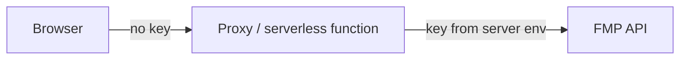

# Security and Privacy

Last updated: 2026-10-08

## 1. Static frontend security model

Value Stock Finder is a single static HTML file that runs entirely in the browser. **There is no server-side component.** Every request to a data provider is made by the user's browser and carries the user's own credentials.

This means:

- There is **no place to keep a secret**. Anything the page uses, the user (and anyone with access to the browser) can see.
- Security relies on running the app **locally, for personal use, with your own key**.

## 2. API key risk

| Fact | Implication |
| --- | --- |
| The key is typed into a password-type input | It is masked on screen only. It is readable from the DOM. |
| The key is stored in `localStorage` | Readable by any script on the same origin and by anyone with access to the browser profile |
| The key is sent as the `apikey` URL query parameter | Visible in dev tools network logs, and potentially in proxy or corporate logs |
| No backend | **A static HTML app cannot truly hide API keys.** |

**Never** host this page publicly with a key filled in, embed a key in `index.html`, or commit a key to Git.

## 3. localStorage risk

`localStorage` is a **convenience, not secure storage**:

- It is not encrypted.
- It persists until it is cleared.
- It is shared by every page on the same origin. If the file is served from a shared origin, such as a dev server also hosting other apps, those apps could read it.
- Browser extensions with page access can read it.

## 4. What is stored locally

| Key | Content | Cleared by |
| --- | --- | --- |
| `valueStockFinderApiKey` | FMP API key | **נקה API Key שמור**, or clearing site data |
| `valueStockFinderProvider` | `fmp` or `yahoo` | Clearing site data |
| `valueStockFinderFmpCache:*` | FMP JSON responses (public market and fundamental data) | **נקה Cache** |
| `valueStockFinderYahooCache:*` | Mapped Yahoo quotes | **נקה Cache** |

## 5. What is not stored

- No account, name, email or personal profile.
- No portfolio or holdings.
- No scan results after the page is closed. Results live in memory only, unless you export a CSV.
- Nothing is sent anywhere except to the selected data provider. There is no analytics, telemetry or third-party script.

## 6. User responsibilities

- Use your own FMP key and keep it private.
- Run the app locally. Don't publish a copy containing your key.
- Clear the saved key on shared computers.
- Rotate your key in the FMP dashboard if you suspect it was exposed.
- Treat the outputs as educational, not as advice.

## 7. Recommended future option: backend or proxy (not implemented)

To actually hide the key, the browser must stop calling FMP directly:

This would also require access control on the proxy (otherwise anyone can spend your quota), rate limiting and secret management. It is intentionally deferred. See [ADR-0003](decisions/ADR-0003-no-backend-yet.md).

## 8. Dependency and code-safety notes

- **No dependencies, CDN scripts or build tools.** This removes supply-chain risk.
- Dynamic values inserted with `innerHTML` go through `escapeHtml` to avoid HTML injection from provider data.
- `localStorage` access is wrapped in `try/catch`, so restricted contexts don't crash the app.
- Agents and contributors must run the secret scan before every PR ([verification.md](verification.md)).

## 9. Financial advice disclaimer

Value Stock Finder is an educational tool. Its outputs are not investment advice and do not identify good or bad investments. Data may be incomplete or wrong. Consult a licensed professional before making investment decisions.
